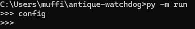

# ANTTIQUE WATCHDOG v3.0

Scheduler over "book antique store" scrapers, allowing you to automatize controling and keeping up with second hand book issues, making you never miss any rare book!

This is my first project on my journey to become a software developer.
I follow (I at least hope) good practices and try to make code maintainable, modular and extensible, although they are and they will mistakes I discover and repair later.

## Table of Contents:

- [Installation](#installation)
- [Usage](#usage)
- [Features](#features)
- [Contributing](#contributing)
- [License](#license)
- [Contact](#contact)

## Installation
For installation clone this source code anywhere you want into your computer,
but consider not putting into Program Files or such folders, app manipulates with files and
need to have rights to modify its root directory.

    git clone https://github.com/HakuTheDeadBoi/antique-watchdog
    python -m pip install -r requirements.txt

## Usage
Navigate into directory:

    cd antique-watchdog

Run REPL:

    python -m run

First ConfigEditor pops up and lets you to submit configuration before scheduler actually runs.

QueryEditor is still missing, user has to manually edit queries.yaml file, but editor which will pop up after ConfigEditor will follow soon.

REPL loop allows you to invoke editors again and modify queries and config during runtime. More commands still wait to be implemented.

Commands:
    - config - open ConfigEditor, tool which allow you to configure app in runtime
    - query - opne QueryEditor - not implemented yet
    - exit - exists program
    - everything else - ignored by REPL

This is final mail report. Is looks ugly but I am working on making it look better.

## Features

It is build with those modules:
    - BeautifulSoup: for scraping web and parsing
    - requests: for handling https requests
    - PyYAML: for handling queries in .yaml format
    - Unidecode: for translating non-ascii regional chars into ASCII equivalent
    - email-validator: for formal email address validating (not ensuring address really exists)

## Contributing

Just my work now.

## License

Eat it if you want LICENSE. :-) :-)
Will be updated once.

## Contact

Email: HakuTheDeadBoi@protonmail.com